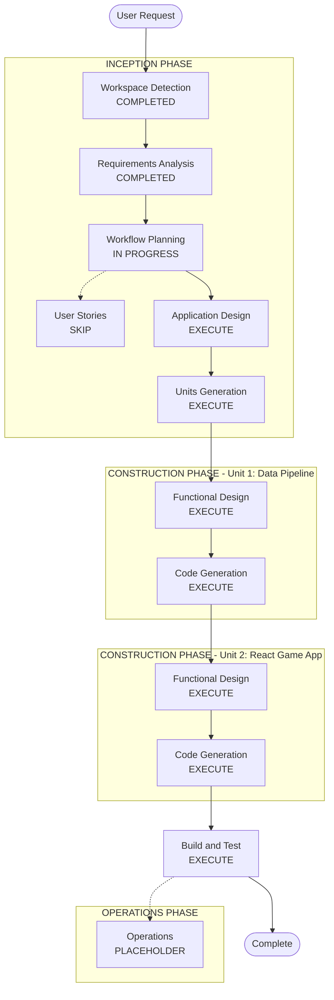

# Execution Plan
# Krónan Higher or Lower Game

## Detailed Analysis Summary

### Change Impact Assessment
- **User-facing changes**: Yes — entirely new user-facing web application
- **Structural changes**: Yes — new project with two distinct components (pipeline + frontend)
- **Data model changes**: Yes — new `products.json` data schema derived from Krónan API
- **API changes**: Yes — integrating with external Krónan REST API (build-time only)
- **NFR impact**: Minimal — local dev only, no performance or security extensions enabled

### Risk Assessment
- **Risk Level**: Low-Medium
- **Rationale**: Clear game concept, well-documented external API, no runtime API calls, no auth in the game UI, no database. Main unknowns are the shape of price-per-unit data from the Krónan API.
- **Rollback Complexity**: Easy — greenfield, no existing system to break
- **Testing Complexity**: Moderate — game state logic has branching paths (lives, streak, modes)

---

## Workflow Visualization



### Text Alternative
```
INCEPTION PHASE:
  [x] Workspace Detection       - COMPLETED
  [x] Requirements Analysis     - COMPLETED
  [ ] User Stories              - SKIP (clear requirements, single persona)
  [ ] Workflow Planning         - IN PROGRESS
  [ ] Application Design        - EXECUTE
  [ ] Units Generation          - EXECUTE

CONSTRUCTION PHASE - Unit 1: Data Pipeline:
  [ ] Functional Design         - EXECUTE
  [ ] NFR Requirements          - SKIP (no NFR extensions enabled)
  [ ] NFR Design                - SKIP (no NFR extensions enabled)
  [ ] Infrastructure Design     - SKIP (local dev only)
  [ ] Code Generation           - EXECUTE

CONSTRUCTION PHASE - Unit 2: React Game Application:
  [ ] Functional Design         - EXECUTE
  [ ] NFR Requirements          - SKIP
  [ ] NFR Design                - SKIP
  [ ] Infrastructure Design     - SKIP
  [ ] Code Generation           - EXECUTE

  [x] Build and Test            - EXECUTE (after all units)

OPERATIONS PHASE:
  [ ] Operations                - PLACEHOLDER
```

---

## Phases to Execute

### INCEPTION PHASE
- [x] Workspace Detection — COMPLETED
- [x] Requirements Analysis — COMPLETED
- [ ] User Stories — **SKIP**
  - *Rationale*: Single user persona (casual player), requirements are clear and complete, no multi-stakeholder complexity.
- [ ] Workflow Planning — IN PROGRESS
- [ ] Application Design — **EXECUTE**
  - *Rationale*: New system with multiple components. Component boundaries (pipeline, game engine, UI components, state management), interfaces, and service layer design need explicit definition before code generation.
- [ ] Units Generation — **EXECUTE**
  - *Rationale*: Two clearly distinct units exist — (1) data pipeline script and (2) React game app. They have separate tech concerns, entry points, and can be developed and verified sequentially.

### CONSTRUCTION PHASE

#### Unit 1: Data Pipeline Script
- [ ] Functional Design — **EXECUTE**
  - *Rationale*: Non-trivial logic: Krónan API pagination, product filtering rules (image + price + price-per-unit), rate limit handling, price-per-unit computation across different unit types (kg, litre, piece).
- [ ] NFR Requirements — **SKIP**
  - *Rationale*: No performance/security/scalability extensions enabled. Local script only.
- [ ] NFR Design — **SKIP**
  - *Rationale*: Follows from NFR Requirements skip.
- [ ] Infrastructure Design — **SKIP**
  - *Rationale*: Local development only. No cloud infrastructure.
- [ ] Code Generation — **EXECUTE** (ALWAYS)

#### Unit 2: React Game Application
- [ ] Functional Design — **EXECUTE**
  - *Rationale*: Non-trivial game state machine: lives system, streak logic, mode switching, round progression (product slides left), game over transitions. Needs detailed design before coding.
- [ ] NFR Requirements — **SKIP**
  - *Rationale*: No NFR extensions enabled.
- [ ] NFR Design — **SKIP**
  - *Rationale*: Follows from NFR Requirements skip.
- [ ] Infrastructure Design — **SKIP**
  - *Rationale*: Local dev only (`npm run dev`).
- [ ] Code Generation — **EXECUTE** (ALWAYS)

#### After All Units
- [ ] Build and Test — **EXECUTE** (ALWAYS)
  - *Rationale*: Build instructions, unit tests (game logic), integration tests (pipeline → frontend data flow), and manual test checklist.

### OPERATIONS PHASE
- [ ] Operations — PLACEHOLDER

---

## Unit Definitions (Preview)

| Unit | Description | Key Deliverables |
|---|---|---|
| Unit 1: Data Pipeline | Node.js/TypeScript CLI script that queries Krónan API and produces `products.json` | `scripts/fetch-data.ts`, `src/data/products.json` schema |
| Unit 2: React Game App | React + TypeScript SPA implementing the full game (start screen, game loop, game over) | React components, game state logic, localStorage integration |

---

## Success Criteria
- **Primary Goal**: A playable Higher or Lower game using Krónan grocery product prices
- **Key Deliverables**:
  1. Working data pipeline that produces a valid `products.json` from the Krónan API
  2. React app implementing the full game loop with Normal/Hard modes and lives system
  3. Correct price-per-unit comparisons with no mathematical errors
  4. Streak tracking persisted in localStorage
  5. Icelandic UI throughout
  6. README with full setup instructions
- **Quality Gates**:
  - Data pipeline filters correctly (only products with image + price + price-per-unit)
  - Game state machine handles all edge cases (equal prices, last life, streak reset)
  - App runs locally with `npm install && npm run dev`
